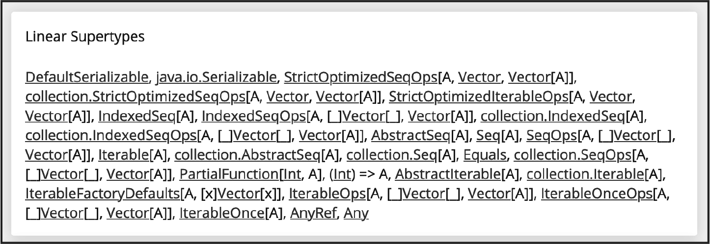
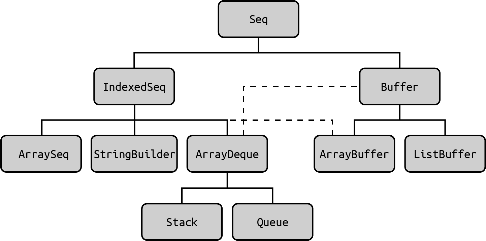
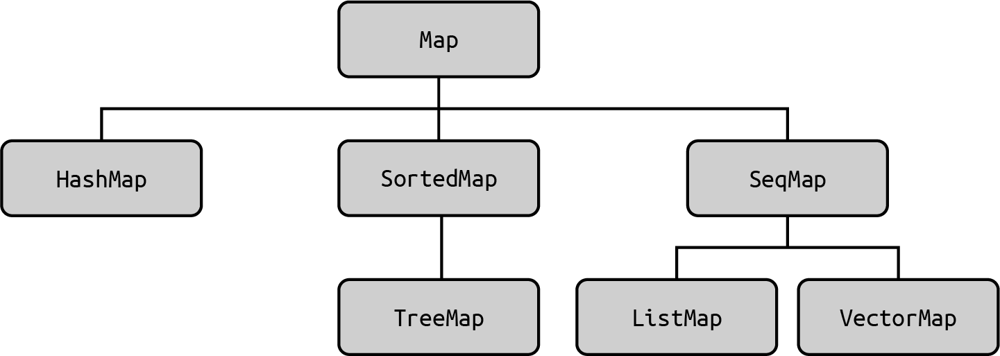
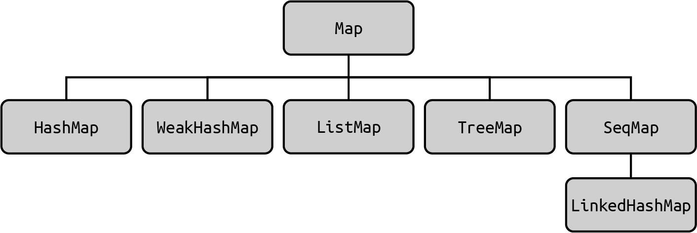
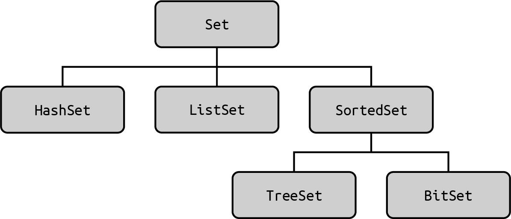

# 11. 集合：介绍

这是涵盖Scala集合类的五章中的第一章。因为集合对任何编程语言都非常重要，这些章节详细介绍了Scala的各个集合类和方法。此外，这些章节在 *Scala Cookbook* 的第二版中已经重新编排过，更易于发现使用的诀窍。

集合的第一章介绍了集合类。这本章的目的如何按照具体的需求，挑选并组织一个适合的集合类。例如，如果你想要一个索引，不可变的序列，推荐使用 **Vector** 作为首选序列，但如果您想用索引，可变的序列则推荐**ArrayBuffer**。

本章之后，第12章介绍了最常用的Scala序列类，包括 **Vector**、**ArrayBuffer**、**List** 和 **Array**。其他小节覆盖了**ListBuffer**和**LazyList**。

第13章提供了Scala序列类中最常用的方法。集合类以其内置可用的方法深入而闻名，并且这章演示了这些方法。

第14章介绍了 **Map** 类型。Scala **Map**类似于 Java **Map**、Ruby **Hash** 或Python **Dictionary**，因为它们由键值对组成，其中键必须唯一。Scala同时有可变和不可变的**Map**，它们都包含在这章中。

最后，第15章介绍了其他集合类型，包括常用的**Tuple**和**Range**类型，以及**Set**、**Queue**和**Stack**。

## Scala不是Java

Scala的集合类设计既深又广，和其他语言相比，例如Java，集合类有很大不同。刚接触使用的时候，有可能有些不太适应，但长期使用起来，你会感受到它们的优雅。

这些方法非常实用，所以很少需要自己写**for**循环了。事实证明，许多自己写**for**循环的人一直遵循特定的循环模式，因此这些循环被封装在集合的内置方法中，如**filter、map、foreach**等。第一版的Scala Cookbook在2013年发布，丰富的集合方法对于有Java背景的人来说是相当震惊的，但如今Java集合也有很多函数式接口，过渡到Scala会容易很多。

然而，当你开始使用Scala时，最好还是忘记Java集合类，并专注于Scala集合。例如，当Java开发人员第一次使用Scala时，他们可能会想，“好的，我要使用列表和数组，对吧? ，”不，Scala **List**类与Java **List**类非常不同，其中包括Scala **List**是不可变的部分。虽然Scala **Array**是围绕Java **Array**的包装器。并且提供了许多用于处理数组的内置方法，但是不推荐它作为顺序集合类。

根据我的经验，我从Java转到Scala，一直尝试在Scala应用中使用Java集合，这太浪费时间了。虽然Java集合在Scala中工作良好，但仅适用于与Java代码互操作中。现在回想起来，尝试使用Java集合类作为我的Scala应用程序中默认的集合只会减慢我的学习进度。与其和我一样，我鼓励你直接正确深入和学习Scala的方式！ 本章将帮助你找到那些需要的类。

## Scala 2.13 集合全面改造

最后顺带提一句，Scala 2.13版本（于2018年结束）其对集合库的全面改造是出了名的猛。这些集合的”幕后改造“主要涉及了特质和类型继承的重大变化，幸亏这些变化在多数情况下对用户是没有影响的。

这是一件好事，因为 Scala 开发人员享受集合的最终结果。因此，你使用外部 API的类，如 **List**、**Vector**、**ArrayBuffer**、**Map** 和 **Set**—基本保持不变。如果有的话，Scala 2.13和Scala 3已经简化了这些内部表示，因此你的代码和类型比之前都简单。

提到这次全面改造是因为 Scala 3 的集合库是紧随着 Scala 2.13集合库而变化，所以随着除了元组（在 Scala 3 中已明显更新）之外，许多集合就像在Scala 2.13中一样工作。同样，这是一件好事。如果你对Scala 2.13全面改造的细节感兴趣，这有三个很好的资源讲述这些变化背后的故事：

- The Scala 3 page about Scala 2.13’s collections （ *https://oreil.ly/XvTpt* ）
- The Scala 3 page about the architecture of Scala 2.13’s collections （ *https://oreil.ly/NLcek* ）
- An overview of the Scala 2.13 class hierarchy （ *https://oreil.ly/nZ5R5* ）

## 理解集合的层次

关于集合，首先需要了解的是它们都包含在表11-1的包中。一般来说，集合中的**scala.collection**是**scala.collection.immutable**和**scala.collection.mutable**的超类（或者准确地说是超类型）。这意味着基本操作由**scala.collection**所提供。并且不可变和可变操作被添加到其它两个包的类型中。

*表11-1. 包含Scala集合的包*

| 字符序列                       | 描述                          |
| -------------------------- | --------------------------- |
| scala.collection           | 集合是不可变或者可变的                 |
| scala.collection.immutable | 不可变集合。创建之后永远不变。             |
| scala.collection.mutable   | 可变集合。它们有一些（或许多）方法允许更改集合的元素。 |

## 集 —— 既深又广

Scala集合层次结构非常丰富 —— 即深又广。当你选择一个类或者方法解决问题时，理解它们是如何组织的将会非常有用。图11-1显示了**Vector**类继承的特质，并展示了Scala集合层次结构的复杂性。



*图11-1. Vector类所继承的特质*

因为（a）Scala类可以从traits继承，（b）精心设计的traits是粒状的，所以类层次结构可以如下所示。然而，不要让图11-1让你陷入困境。使用**Vector**不需要知道所有这些traits。事实上，使用**Vector**很直接：

```scala
    val x = Vector(1, 2, 3)
    x.sum                   // 6
    x.filter(_ > 1)         // Vector(2, 3)
    x.map(_ * 2)            // Vector(2, 4, 6)
    x.takeWhile(_ < 3)      // Vector(1, 2)
```

在高层次上，Scala的集合类以**Iterable** 特质开始并扩展到序列（**Seq**）、集合（**Set**）和映射（**Map**）的三个主要类别。序列进一步分成了 *indexed* 和 *linear* 序列，如图11-2所示。


*图11-2. Scala集合的高层视图*

**Iterable** 特质中定义了一个*迭代器（iterator）*，它可以让你一个一个地循环访问一个集合的元素。但是当使用迭代器时，集合只能被遍历一次，因为每个元素在迭代过程中都被消耗掉了。

### Sequences

再深入一点挖掘*sequence*层次结构，Scala包含大量的序列类型。最常见的*immutable*序列如图11-3所示，最常见的*mutable*序列如图11-4所示。


*图11-3 部分Scala不可变序列层次结构*



*图11-4 部分Scala可变序列层次结构*

如图11-3所示，不可变序列分成两大类： *indexed sequences*和*linear sequences*（链表）。**IndexedSeq**显示元素的随机访问是有效的，例如访问**Vector**元素为**xs(1 _000_000)**。默认情况下，指定使用Scala 3的**IndexedSeq**将创建一个**Vector**：

```
    scala> val x = IndexedSeq(1,2,3)
    x: IndexedSeq[Int] = Vector(1, 2, 3)
```

**LinearSeq**意味着一个集合可以被有效地分割成头部和尾部组件，通常使用时候用**head**、**tail**和**isEmpty**方法。注意，在Scala 3中创建**LinearSeq**会创建一个**List**，这是一个单链表：

```
    scala> val xs = scala.collection.immutable.LinearSeq(1,2,3)
    xs: scala.collection.immutable.LinearSeq[Int] = List(1, 2, 3)
```

在图11-4所示的可变序列中，**ArrayBuffer**是最常见的。当需要可变序列时，建议使用。这里快速展示
如何使用**ArrayBuffer**：

```
    scala> import scala.collection.mutable.ArrayBuffer

    scala> val xs = ArrayBuffer(1,2,3)
    val xs: ArrayBuffer[Int] = ArrayBuffer(1, 2, 3)

    scala> xs.addOne(4)
    val res0: ArrayBuffer[Int] = ArrayBuffer(1, 2, 3, 4)

    scala> xs.addAll(List(5,6,7))
    val res1: ArrayBuffer[Int] = ArrayBuffer(1, 2, 3, 4, 5, 6, 7)
```

上面展示了**addOne**和**addAll**方法，但这是新添加的；从历史上看，通常使用 **+=** 和 **++=** 也能达到上面目的：

```
    scala> xs += 8
    val res2: ArrayBuffer[Int] = ArrayBuffer(1, 2, 3, 4, 5, 6, 7, 8)
    scala> xs ++= List(9,10)
    val res3: ArrayBuffer[Int] = ArrayBuffer(1, 2, 3, 4, 5, 6, 7, 8, 9, 10)
```

### Maps

和Java **Map**、Ruby **Hash**或**Python**字典一样，Scala **Map**是键/值集合，其中所有键必须唯一。最常见的不可变和可变Map类分别如图11-5和11-6所示。



*图11-5 常用的不可变Map类*



*图11-5 常用的可变Map类*

Map类型在14.1小节“创建和使用Map”中有介绍。当只需要一个简单的不可变**Map**时，可以不需要**import**语句创建**Map**：

```
    scala> val m = Map(1 -> "a", 2 -> "b")
    val m: Map[Int, String] = Map(1 -> a, 2 -> b)
```

可变**Map**默认不在作用域内，必须导入或指定完整路径去使用：

```
    scala> val mm = collection.mutable.Map(1 -> "a", 2 -> "b")
    val mm： scala.collection.mutable.Map[Int, String] = HashMap(1 -> a, 2 -> b)
```

### Sets

和Java Set一样，Scala **Set**是包含唯一元素的集合。常用不可变的和可变**Set**类分别如图11-7和11-8所示。



*图11-7. 常用不可变Set类*


*图11-8. 常用可变Set类*

集合特质和类在15.3小节“创建集合和添加元素”中有介绍，但作为快速浏览，如果只是需要一个不可变**Set**，你可以不需要**import**语句创建：

```
    scala> val set = Set(1, 2, 3)
    val set： Set[Int] = Set(1, 2, 3)
```

和**Map**一样，如果你想使用一个可变的**Set**，必须导入或指定完整路径去使用：

```
    scala> val mset = collection.mutable.Set(1, 2, 3)
    val mset: scala.collection.mutable.Set[Int] = HashSet(1, 2, 3)
```

总结下，以上是Scala集合层次结构的概述。

## 11.1 选择一个集合类

### 问题

选择Scala集合类去解决特定的问题。

### 解决方案

集合类有三大类可选择：

- **Sequence**
- **Map**
- **Set**

**Sequence**是可被索引或线性(链表)的元素组成的集合，*map*包含唯一键的键/值对的集合，就像Java **Map**，
Ruby **Hash**，或者Python **Dict**。集合是一个不包含重复元素的**Sequence**。

除了这三个主要类别外，还有其余有用的集合类型，包括**Range**、**Stack**和**Queue**。其它有些像集合，包括
**Tuples**和**Option**、**Try**和**Either**错误处理类。

#### 选择Sequence

在选择一个**Sequence**时（一个连续的元素集合），有两个主要考虑：

- 序列是否应该被索引，且允许快速访问任何元素，还是应该作为一个去链表实现?
- 想要一个可变的还是不可变的集合?

从Scala 2.10到Scala 3，一般顺序集合推荐可变/不可变和索引/线性的组合，如表11-2所显示。

*表11-2. Scala推荐的通用目的顺序集合*

|                       | Immutable | Mutable     |
|-----------------------|-----------|-------------|
| Indexed               | Vector    | ArrayBuffer |
| Linear (Linked lists) | List      | ListBuffer  |

举一个例子，如果你想要一个不可变的，索引的集合一般来说，应该使用**Vector**，如果您想要一个可变的、索引的集合，请使用**ArrayBuffer**等。

虽然这是一般性的建议，但是序列还有更多可选项。表11-3中显示了最常见的不可变序列的选择。

*表11-3. 主要不可变序列选择*

| Class    | IndexedSeq | LinearSeq | Description                                                         |
|----------|------------|-----------|---------------------------------------------------------------------|
| LazyList |            | √         | 与**List**类似，是一个链表，但是惰性的，元素是记忆的。适用于大序列或无穷序列。(替换Scala 2 **Stream**类。) |
| List     |            | √         | 首选不可变线性序列，是一个单链表。适用于**prepend**元素，以及对列表的**head**和**tail**进行操作的递归算法。 |
| Queue    |            | √         | 先进先出的数据结构。有不可变和可变版本。                                                |
| Range    | √          |           | 间隔均匀的整数或字符。                                                         |
| Vector   | √          |           | 首选不可变索引序列。Scaladoc表明，“随机访问和更新在常数时间内，并很快地**append**和**prepend**。”    |

最常见的可变序列选择如表11-4所示。**Queue** 和 **Stack** 也在其中，因为这些类有不可变和可变版本。 描述中的所有引用都来自每个类的Scaladoc。

*表11-4. 主要可变序列选择*

| Class         | IndexedSeq | LinearSeq | Buffer | Description                                                                                                                                     |
|---------------|------------|-----------|--------|-------------------------------------------------------------------------------------------------------------------------------------------------|
| Array         | √          |           |        | 基于Java 数组，元素可变，数组大小不可变。                                                                                                                         |
| ArrayBuffer   | √          |           | √      | 首选可变索引序列。“内部基于数组。 **append**、更新和随机访问是常数时间（分摊时间）。**prepend**和**remove**在缓冲区大小是线性时间的。”                                                            |
| ArrayDeque    | √          |           |        | 双端队列。可变 **Stack** 和 **Queue** 类的超类。“**append**, **prepend**, **removeFirst**、**removeLast** 和随机访问是常数时间。”                                        |
| ListBuffer    |            | √         | √      | 类似于**ArrayBuffer**，但基于**List**。文档指出，“如果打算将buffer转换为list，使用 **ListBuffer** 而不是 **ArrayBuffer**。” 提供**prepend** 和 **append** 是常数时间；其他操作大部分是线性时间的。 |
| Queue         | √          |           |        | 先进先出的数据结构。                                                                                                                                      |
| Stack         | √          |           |        | 后进先出的数据结构。                                                                                                                                      |
| StringBuilder | √          |           |        | "可变字符序列的构建器。 提供了与**java.lang.StringBuilder**兼容的API。”                                                                                            |

注意我在两列下列举了 **ArrayBuffer** 和 **ListBuffer**。 因为虽然它们都是 **Buffer** 的后代——一个可以增长和缩减的 **Seq**——**ArrayBuffer** 的行为类似于 **IndexedSeq**，而 **ListBuffer** 的行为类似于 **LinearSeq**。

除了表中显示的内容外，性能也是一个考虑因素。如果在选择过程中注重性能，可以参阅11.2小节。

在为库创建API时，也许希望通过序列的超类来引用序列。表11-5显示了在API中集合经常使用的特质。注意，描述中的所有引用都来自每个类的Scaladoc。

*表11-5. 类库API中常用的特质*

| 特质         | 描述                                                    |
|------------|-------------------------------------------------------|
| IndexedSeq | 随机访问元素是高效的，有高效的**apply**和**length**方法。                |
| LinearSeq  | 线性访问元素是高效的，有高效的**head**和**tail**操作。                   |
| Seq        | 顺序集合的基础特质。在不需要指出序列是索引或线性时使用                           |
| Iterable   | 最高层级的集合。当返回的类型非常通用时使用。（相当于声明一个Java方法返**Collection**。） |

#### 选择Map

虽然通常可以使用基本的不可变或可变**Map**类，但还有更多类型可以使用。**Map**类选择如表 11-6 所示。 注意，描述中的所有引用都来自每个类的Scaladoc。

*表11-6 常见的Map选择*

| 类                     | 不可变 | 可变  | 描述                                                        |
|-----------------------|-----|-----|-----------------------------------------------------------|
| CollisionProofHashMap |     | √   | 基于红黑树的哈希表实现可变映射，在哈希冲突的最坏情况下获得良好的性能。                       |
| HashMap               | √   | √   | 不可变版本用“hash trie”实现。可变版本用“hashtable”实现。                   |
| LinkedHashMap         |     | √   | 可变版本基于“hashtable”实现。元素按插入顺序返回。                            |
| ListMap               | √   | √   | 基于list数据结构实现的map。元素按插入的相反顺序返回，因为每次插入的元素都放在头部。             |
| Map                   | √   | √   | 基础map，有可变和不可变的实现。                                         |
| SeqMap                |     | √   | 有序可变映射的通用特质。                                              |
| SortedMap             | √   | √   | 按排序顺序存储key的基本特质。                                          |
| TreeMap               | √   | √   | 排序map，基于红黑树实现。有关性能说明参阅Scaladoc。                           |
| TreeSeqMap            | √   |     | 保持有序，默认插入顺序，也可用修改顺序。                                      |
| VectorMap             | √   |     | 基于vector/map的数据结构，保持插入顺序。 “通过额外内存，保证了常数时间查找，但对于其他操作性能较低”。 |
| WeakHashMap           |     | √   | 弱引用的hashmap，**java.util.WeakHashMap**的包装                  |

关于基本**Map**类的细节，参阅14.1节“创建和使用**Map**”，关于选择Map类的更多内容，参阅14.2节“选择**Map**实现”。关于排序**Map**类的详细信息，参阅14.10节“按键或值对现有**Map**进行排序” 。

#### 选择Set

当选择**Set**时，有基本的可变和不可变集合类，**SortedSet**按键顺序返回元素，**LinkedHashSet**按插入顺序存储元素，以及其他用于特殊目的集合。常用类如表11-7所示。注意描述中的所有引用都来自于每个类的Scaladoc。

*表11-7 常见的Set选择*

| 类             | 不可变 | 可变  | 描述                                        |
|---------------|-----|-----|-------------------------------------------|
| BitSet        | √   | √   | 一组“非负整数，压缩成64位字长的可变位数组”。用于有一组小整数时节省内存。    |
| HashSet       | √   | √   | 不可变版本基于“hash trie”实现，可变版本基于“hashtable”实现。 |
| LinkedHashSet |     | √   | 基于hashtable实现的可变set，按插入顺序返回元素。            |
| ListSet       | √   |     | 基于list结构实现set，”仅适用于少数元素。”                 |
| TreeSet       | √   | √   | 不可变版本基于树实现，可变版本基于可变红黑树实现。                 |
| Set           | √   | √   | 通用的基础特质。既有可变也有不可变实现。                      |
| SortedSet     | √   | √   | 排序集合的基础特质。                                |

关于基本**Set**类的详细内容，参阅15.3小节“创建集合并添加元素”，关于可排序**Set**的详细内容，参阅15.5小节“按排序顺序在Set中存储值”。

#### 类似于集合的类型

Scala提供了其他集合类型，有些类型类似于集合，因为它们有**map**，**filter**等方法。表11-8提供了几种类型的描述，这些类型类似于集合但并不是。

*表 11-8 其他集合类（以及类似于集合的类型）*

| 类/特质     | 描述                                                                                                    |
|----------|-------------------------------------------------------------------------------------------------------|
| Iterator | 不是集合，但提供了访问集合中元素的方法。 定义了普通集合类中常见的方法，如 **foreach**、**map**、**flatMap** 等。在需要时可将迭代器转换为集合。               |
| Option   | 包含一个或零个元素的集合。**Some**和**None**继承自Option。**Some**是一个元素的容器，None没有元素。                                    |
| Tuple    | 支持异构的集合元素，有一些类似集合的方法，包括**drop**，**head**、**map**、**size**、**tail**、**take**、**splitAt** 和 **toList**。 |

因为在表11-8中提到了**Option**，所以值得注意的是，**Either/Left/Right** 和 **Try/Success/Failure** 类也有些类似集合的方法，例如 **flatten** 和 **map**，但没有 **Option** 提供的这么多。

#### 严格和惰性集合

另一种思考集合的方式是它们是严格的还是非严格的（也称为*lazy*）。要理解严格和懒惰的集合，首先要理解转换器方法的概念。

*transformer*方法从现有的集合中构造一个新的集合。包括**map**、**filter**、**reverse**等方法--这些方法将输入集合转换为新的输出集合。不返回一个新的集合方法如**foreach**、**size**、**head**等--不是转换器。

基于以上定义，集合可以被认为是严格或懒惰的。在一个*strict*的集合中，元素的内存会立即分配，当调用转换方法时，所有元素都被立即计算。相反，在一个*lazy*的集合中，元素的内存不会立即分配，直到需要时，转换器方法才会构造新的元素。

在Scala中，除了这两种情况，所有的集合都是严格的：

- **LazyList**是惰性版本的**List**。
- 在集合上创建*view*时，比如调用**Vector(1,2,3).view**，产生视图的转换方法是懒惰的。

视图内容详见11.4小节：“在集合上创建惰性视图”。

### 另见

除了我使用集合的经验外，用于创建这些表的大部分内容来自每个类型的Scaladoc，以及这些Scala页面：

- The Scala documentation on mutable and immutable collections（ *https://oreil.ly/HLRvl* ）
- The Architecture of Scala Collections（ *https://oreil.ly/mJVRP* ）

## 11.2 理解集合的性能

### 问题

当给应用程序选择集合时，如果性能很重要，希望为算法选择正确的集合。

### 解决方案

在许多情况下，可以通过了解集合的基本结构来理解集合的性能。例如**List**是一个单链表，且没有索引，如果需要访问 **list(1_000_000)** 这样的元素，则需要遍历一百万个元素。所以比访问 **Vector** 的第一百万位的元素要慢得多，因为 **Vector** 是索引的。

在其他情况下，查看表格会有所帮助。例如表11-10显示了对 **Vector** 的*append*操作是 eC，或者 *effectively constant time*。所以在我的电脑REPL中，一秒内可以创建一个很大的**Vector**，如下所示：

```
    var a = Vector[Int]()
    for i <- 1 to 50_000 do a = a :+ i
```

但是如表格所示，对**List**进行*append*操作需要线性时间，因此尝试创建相同大小的**List**需要更长的时间——超过15秒。

注意这些方式都不推荐用于实际代码。使用它们只是来演示**Vector**和**List**在*append*操作方面的性能差异。

#### 性能特征键

在查看性能表之前，表11-9显示了后面的表中使用的性能特征键。

*表11-9  后续表格的性能特征键*

| 键   | 描述                                              |
|-----|-------------------------------------------------|
| Con | 运算需要（快速）常数时间。                                   |
| eC  | 运算需要常数时间，但依赖一些假设，如**Vector**的最大长度或者hash key的分布。 |
| aC  | 运算需要摊销常数时间。很多操作被执行，一些操作执行较久，平均每个操作是常数时间。        |
| Log | 运算的时间和集合大小的对数成正比。                               |
| Lin | 运算是线性的，因此时间与集合大小成正比。                            |
| -   | 不支持此操作                                          |

#### 顺序集合的性能特征

表11-10展示了对不可变和可变顺序集合操作的性能特征。

*表11-10 顺序集合的性能特征*

|                    | head | tail | apply | update | prepend | append | insert |
|--------------------|------|------|-------|--------|---------|--------|--------|
| **Immutable（不可变）** |      |      |       |        |         |        |        |
| List               | Con  | Con  | Lin   | Lin    | Con     | Lin    | -      |
| LazyList           | Con  | Con  | Lin   | Lin    | Con     | Lin    | -      |
| ArraySeq           | Con  | Lin  | Con   | Lin    | Lin     | Lin    | -      |
| Vector             | eC   | eC   | eC    | eC     | eC      | eC     | -      |
| Queue              | aC   | aC   | Lin   | Lin    | Lin     | Con    | -      |
| Range              | Con  | Con  | Con   | -      | -       | -      | -      |
| String             | Con  | Lin  | Con   | Lin    | Lin     | Lin    | -      |
| **Mutable（可变）**    |      |      |       |        |         |        |        |
| ArrayBuffer        | Con  | Lin  | Con   | Con    | Lin     | aC     | Lin    |
| ListBuffer         | Con  | Lin  | Lin   | Lin    | Con     | Con    | Lin    |
| StringBuilder      | Con  | Lin  | Con   | Con    | Lin     | aC     | Lin    |
| Queue              | Con  | Lin  | Lin   | Lin    | Con     | Con    | Lin    |
| ArraySeq           | Con  | Lin  | Con   | Con    | -       | -      | -      |
| Stack              | Con  | Lin  | Lin   | Lin    | Con     | Lin    | Lin    |
| Array              | Con  | Lin  | Con   | Con    | -       | -      | -      |
| ArrayDeque         | Con  | Lin  | Lin   | Con    | aC      | aC     | Lin    |

表11-10中列标题的含义如表11-11所示。

*表11-11 表11-10中列标题的描述*

| 操作      | 描述                                           |
|---------|----------------------------------------------|
| head    | 选择序列的第一个元素                                   |
| tail    | 生成一个新序列，该序列包含除第一个元素外的所有元素。                   |
| apply   | 索引。                                          |
| update  | 不可变序列的函数式更新，可变序列的副作用更新。                      |
| prepend | 在序列前面添加一个元素。对于不可变序列，产生一个新序列。对于可变序列，修改现有序列。   |
| append  | 在序列末尾添加一个元素。 对于不可变序列，产生一个新序列。 对于可变序列，修改现有序列。 |
| insert  | 在序列中的任意位置插入元素。只能在可变序列中使用。                    |

#### Map和Set的性能特征

表11-12展示了Scala 的常见**Map**和**Set**类型的性能特征，并且使用表11-9中的键。

*表11-12. Map和Set的性能特征*

|                    | lookup | add | remove | min |
|--------------------|--------|-----|--------|-----|
| **Immutable（不可变）** |        |     |        |     |
| HashSet/HashMap    | eC     | eC  | eC     | Lin |
| TreeSet/TreeMap    | Log    | Log | Log    | Log |
| BitSet             | Con    | Lin | Lin    | eC  |
| VectorMap          | eC     | eC  | eC     | Lin |
| ListMap            | Lin    | Lin | Lin    | Lin |
| **Mutable（可变）**    |        |     |        |     |
| HashSet/HashMap    | eC     | eC  | eC     | Lin |
| WeakHashMap        | eC     | eC  | eC     | Lin |
| BitSet             | Con    | aC  | Con    | eC  |
| TreeSet            | Log    | Log | Log    | Log |

表11-13提供了对表11-12 中使用的列标题（操作）的描述。

*表11-13 表11-12中列标题的描述*

| 操作     | 描述                                       |
|--------|------------------------------------------|
| lookup | 测试元素是否在**set**中，或者查找**map**中key关联的value。 |
| add    | 新元素添加到**set**或**map**的键值对中。              |
| remove | 从**set**删除元素，或**map**中删除key。             |
| min    | **set**中最小元素或**map**中最小的key。             |

### 讨论

从表11-9中对键的描述可以看出，在选择集合时，通常想找到Con、eC和aC键以获得最佳性能。

例如，由于**List**是一个单链表，访问头部和尾部元素是快速操作，*prepend*元素的过程也是如此，所以这些操作在表11-10 中用Con键显示。但是将元素*append*到**List**是一个很慢的操作———与List的大小成线性关系—所以*append*操作使用Lin键显示。  

### 另见

- 经过EPFL（ *https://www.epfl.ch/labs/lamp* ）许可，本小节的表格从Scala 性能特征文档页面（ *https://oreil.ly/2pDnn* ）重新生成而来。

## 11.3 理解可变变量与不可变集合

### 问题

你可能见过将不可变集合设置为可变变量（**var**）时看起来是可变的。例如，当把一个不可变的**Vector**赋给一个可变变量（**var**）时，似乎可以给它添加元素：

```
    var x = Vector(1)   // x: Vector(1)
    x = x :+ 2          // x: Vector(1, 2)
    x = x ++ List(3, 4) // x: Vector(1, 2, 3, 4)
```

怎么会这样？

### 解决方案

尽管看起来在改变一个不可变集合，但实际上每次添加元素时，变量**x**都指向一个新的序列。**x**是可变的——就像java中的非**final**字段——因此每次执行时实际上会重新赋值一个新序列。最终结果类似于下面代码：

```
    var x = Vector(1)
    x = Vector(1, 2)        // reassign x
    x = Vector(1, 2, 3, 4)  // reassign x again
```

上面代码的第二和第三行，x的引用赋值给一个新的序列。

可以证明**Vector**本身是不可变的。试图改变其中的一个元素，将不会重新赋值给变量，会产生错误：

```
    scala> x(0) = 100
    1    |x(0) = 100
        |^
        |value update is not a member of Vector[Int] - did you mean
        |Vector[Int].updated?
```

### 讨论

初学Scala时，本节包含在第一个与集合相关的小节中，你可能对不可变集合拥有可变变量的行为感到惊讶，要明确关于变量：

- 可变变量（**var**）可以重赋值给新数据。
- 不可变变量（**val**）就如Java中的**final**变量，不能被重新赋值。

要明确的是**collections**中：

- 可变集合中的元素可以被改变（如**ArrayBuffer**）。
- 不可变集合中的元素不可被改变（如**Vector**或**List**）。

在纯函数式编程中，可以把不可变变量和不可变集合结合使用，在不太严格的编程风格中，可以使用其他组合。 比如下面两种组合也很常见：

- 不可变变量和可变集合（如 **val ArrayBuffer**）。
- 可变变量和不可变集合（如 **var Vector**）。

集合章节中的这些小节，以及领域建模章节，均展示了这些技术。

## 11.4 在集合上创建惰性视图

### 问题

处理一个大集合，并希望创建惰性版本，在需要时计算和返回结果。

### 解决方案

通过调用**view**方法在集合上创建*view*。这将创建一个新集合，其*transformer*方法以非严格或惰性的方式实现。 例如给定一个大列表：

```
    val xs = List.range(0, 3_000_000) // a list from 0 to 2,999,999
```

假想在它上面调用一些转换方法，比如**map**和**filter**。这是人为的例子，但说明了一个问题：

```
    val ys = xs.map(_ + 1)
        .map(_ * 10)
        .filter(_ > 1_000)
        .filter(_ < 10_000)
```

如果尝试在REPL中运行这个例子，可能会出现致命的错误“out of memory”：

```
    scala> val ys = xs.map(_ + 1)
    java.lang.OutOfMemoryError: GC overhead limit exceeded
```

相反，下面例子几乎会立即返回并且不会抛出错误，因为所做的只是创建一个视图，然后创建四个惰性转换器方法：

```
    val ys = xs.view
        .map(_ + 1)
        .map(_ * 10)
        .filter(_ > 1_000)
        .filter(_ < 10_000)
    // result: ys: scala.collection.View[Int] = View(<not computed>)
```

现在可以使用**ys**而不会耗尽内存：

```
    scala> ys.take(3).foreach(println)
    1010
    1020
    1030
```

在集合上调用**view** 会变成惰性集合，此时在**view** 上调用转换器方法时，元素在访问时才被计算，而不像严格集合“立即”计算。

### 讨论

Scala 文档指出，视图“ 仅构造结果集合的代理，元素仅在需要时才构造……视图是一种特殊的集合，代表一些基本集合，但对所有转换器是惰性的。”

*transformer*可以从一个或多个已有集合构造新集合，包括 **map**、**filter**、**take** 等方法。

#### Transformer方法的官方描述  TODO（鸽子栏）

&nbsp;&nbsp;&nbsp;&nbsp;对于filter这样的方法是否属于转换器方法存在一些争论，但 *Programming in Scala* 一书指出，“我们把这类方法称为转换器，因为它们至少将一个集合作为接收对象，并在结果中生成另一个集合。” 在该声明中，作者特别提到了 **map**、**filter** 和 **++** 方法。

其它不转换集合的方法（如**foreach**）将被“立即”计算。这解释了为什么像下面的转换器方法会返回视图：

```
    val a = List.range(0, 1_000_000)
    val b = a.view.map(_ + 1)   // SeqView[Int] = SeqView(<not computed>)
    val c = b.take(3)           // SeqView[Int] = SeqView(<not computed>)
```

以及为什么 **foreach** 导致动作发生：

```
    scala> c.foreach(println)
    1
    2
    3
```

#### 视图使用场景

使用视图的主要场景是性能。主要在速度、内存或皆有。

关于性能，解决方案中的例子首先展示了（a）耗尽内存的严格方法，然后（b）在同样数据集上使用惰性方法。第一个解决方案的问题是，每次调用**transformer**方法时会创建新的中间集合：

```
    val b = a.map(_ + 1)        // 1st copy of the data
        .map(_ * 10)            // 2nd copy of the data
        .filter(_ > 1_000)      // 3rd copy of the data
        .filter(_ < 10_000)     // 4th copy of the data
```

如果初始集合**a**有十亿个元素，则第一个 **map** 调用会创建一个新的中间集合，其中包含另外十亿个元素。第二个 **map** 调用创建了另一个集合，此时尝试在内存中保存 30 亿个元素，后面以此类推。

为了更清楚地说明这一点，这种方式就像下面写的一样：

```
    val a = List.range(0, 1_000_000_000)    // 1B elements in RAM
    val b = a.map(_ + 1)                    // 1st copy of the data (2B elements in RAM)
    val c = b.map(_ * 10)                   // 2nd copy of the data (3B elements in RAM)
    val d = c.filter(_ > 1_000)             // 3rd copy of the data (~4B total)
    val e = d.filter(_ < 10_000)            // 4th copy of the data (~4B total)
```

相反，在集合上立即创建一个视图时，后面的所有操作实际上是创建一个迭代器：

```
    val ys = a.view
        .map ... // this DOES NOT create another one billion elements
```

与通常性能相关要做的一样，保证在应用中对使用视图和不使用视图进行测试，以找到最有效的方法。

理解视图的另一个与性能相关的原因是，用流的方式处理大型数据集已经变得非常常见，而视图的工作方式与流非常相似。参阅本书的Spark相关小节，如20.1小节“Spark入门”，有大型数据集和流的例子。
